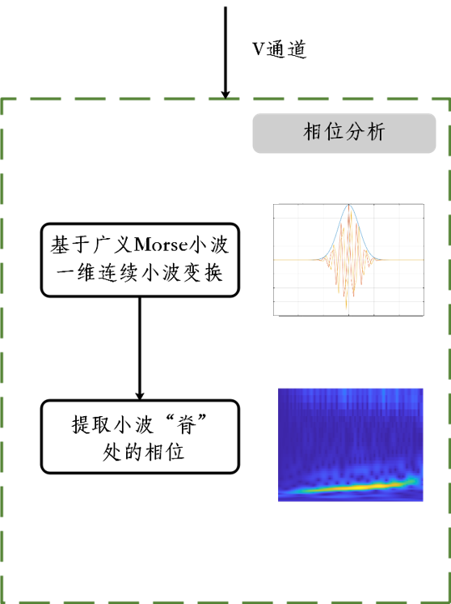

<h1 align="center">
  
   
  基于编码结构光的高铁轮轨姿态三维重建
</h1>

  3D Reconstruction of high-speed rail-wheel based on coded structured light

  
  
 <!---->
  
    
  
  
       
    
    
    
     
     
 <!-- 

    <a href="./Readme.md">中文版本</a>
    ·
    <a href="./Readme-en.md">English Version</a>
  
-->

## [👁️‍🗨️](https://emojipedia.org/eye-in-speech-bubble/) Overview

The wheel-rail attitude of high-speed rail reflects the complex dynamic interaction and restraint relationship between wheels and rails. Mastering the true contact attitude between them is an important foundation for ensuring the safe of high-speed railways. How to accurately obtain the wheel-track attitude of high-speed railways has always been a hot research field in domestic railway scientific research. However, it is imprecise and unreliable to obtain the wheel-rail contact attitude from 2D image. Extracting the feature points of the wheel-rail surface and reconstructing a 3D model can obtain the wheel-rail contact attitude more realistically and accurately.

Due to the fast running speed of high-speed trains, the wheel-rail surface is relatively smooth and there are no obvious feature points, which brings great challenges to the 3D reconstruction based on feature point extraction.

     
     

3D reconstruction technology is an important branch of computer vision technology and a popular research direction combining computer vision and computer image graphics. According to whether it is in contact with the measured object during measurement, it can be divided into contact measurement and non-contact measurement.

Although the contact measurement method has high measurement accuracy, the measurement efficiency is low, the speed is slow, and improper operation can easily damage the surface of the object to be measured, and because the probe has a certain surface area, it is difficult to measure objects with complex surfaces and does not have universality and versatility. Non-contact three-dimensional measurement methods can be divided into two categories: active measurement and passive measurement. The former is to project a designed pattern onto the surface of the target object. The pattern is distorted due to the height fluctuation of the object, and the target object is obtained by matching the distorted pattern. The latter is to illuminate the target object with ambient light and then detect the characteristic points of the target object to obtain its data. The non-contact measurement method has become the research trend of three-dimensional profile measurement due to its advantages of no damage, high measurement speed, and simplicity.
The coded structured light method used in the project uses a certain pattern of coded structured light patterns projected by the projector to encode the target object, uses the camera to obtain the object image, and uses the computer to decode the resulting image, using the image points in the camera and the projector The point correspondence in Calculates the space coordinates of the surface points of the object, obtains the three-dimensional information of the object, and restores the three-dimensional shape of the object. The structured light system is shown in the following figure.

The 3D reconstruction technology of coded structured light method is mainly composed of five key technologies: system calibration, structured light coding, image acquisition, structured light decoding and three-dimensional coordinate calculation.

- System Calibration: The system consists of a camera, a projector and a computer. The goal of calibration is to calculate the internal parameter matrix and the lens distortion coefficient of the camera and the projector and the external parameter matrix of the relative position between the two.
- Structured Light Coding: The "identity" of each point of the pattern can be identified through coding.
-  Image Capture: The projector projects the coded structured light pattern on the surface of the target, and the pattern will be distorted with the modulation of the surface shape of the object. What is captured by the camera is the structured light image modulated by the object. The modulated image reflects the three-dimensional information of the surface shape of the object.
- Structured Light Decoding: Decode the captured structured light image, the decoding method depends on the encoding method. The purpose is to establish the correspondence between the feature points of the camera plane and the projection plane.
- 3D Coordinate Calculation: Using the corresponding relationship between the feature points  and the calibration results, the 3D information of the feature points are obtained based on the principle of triangulation.

The coded structured light mainly include Time-multiplexing and Space Codification. Although Time-multiplexing has good reconstruction accuracy, it is not a good choice for moving objects because of the need to project multiple pictures on the surface of the object. Compared with Time-multiplexing, Space Codification has a lower reconstruction accuracy, but because only one picture is projected, it is often used for object reconstruction of dynamic objects.

In summary, given the difficulty in the project that the surface of the wheel and rail is smooth and the feature points are not easy to extract, the feature points on the surface of the object can be artificially increased by projecting the coding pattern on the surface of the object. The Space Codification only needs a single projection, which is suitable for the reconstruction of dynamic objects. Therefore, this project mainly studies the method of Space Codification to obtain a relatively finer and high-density three-dimensional point cloud (point cloud, a collection of feature points on the surface of the object. These points Contains information such as the three-dimensional coordinates and color of the surface of the object).

## [📷](https://emojipedia.org/camera/) Algorithm

<table><tr><td width="500px">

</td><td>The main innovations of the project are as follows:
    <ul><li><b>Stripe center extraction with sub-pixel precision</b>: Designed and implemented the coded structured light pattern and the stripe center point extraction algorithm suitable for the pattern, and the stripe center point is accurate to the sub-pixel level</li>
        <li><b>Increase point cloud density through wavelet transform</b>: An improved method of windowed Fourier transform for fringe phase analysis is proposed. The wavelet transform based on generalized Morse wavelet is used for analysis to obtain the phase information of non-central points. Increase point cloud density</li>
        <li><b>Construction of a full-process 3D reconstruction platform</b>: The above algorithm and point cloud visualization are packaged into structured light 3D reconstruction software, which completes the 3D reconstruction of rails and multiple geometric bodies, which is expected to be used for wheel-rail posture reconstruction and visualization</li></ul></td></tr></table>

<table> <tr> <td>Pattern Creation</td><td width="600px">The pattern is designed in HSV color space. And the pattern consists on a colored sinusoidal fringe pattern
<ul>
<li> The H channel is coded in the 𝐵(3,4) sequence. The stripes are the basic elements of the coding pattern. Different values correspond to the three colors of red, blue, and green.</li>
<li> The S channel is set to 1 for all pixels.</li>
<li> The V channel is calculated by the sinusodial signal.</li>
</ul>
    
There are 64 stripes in the coding pattern, and the stripe width is 14 𝑝𝑖𝑥𝑒𝑙, with the center point of the stripe as the feature point of the projection pattern

♣ The 𝐷𝑒 𝐵𝑟𝑢𝑖𝑗𝑛 sequence is composed of 𝑛 different elements, and any consecutive subsequence whose length is 𝑚 only appears once
    </td><td>

</td></tr><tr><td> DeBruijn Analysis</td><td>在对灰度图像进行预处理后，为获得条纹中心点的位置，采用局部最大值算法从类似“高斯”形状的条纹灰度图像中提取图像每一行的局部最大值（以亚像素精度检测），局部最大值点即为条纹的中心点。在 𝐿𝑎𝑏 颜色空间下，对条纹中心点的颜色进行分类，在 4×1 的窗口中，即可获得条纹中心点在投影图案的对应位置。After preprocessing the gray image, in order to extract the center point of the stripes, a local maximum algorithm is applied to searching local maxima (detected with sub-pixel precision) of each row of the image from the strips which is present a gaussian-like shape, The local maximum point is the center point of the fringe. In the 𝐿𝑎𝑏 color space, classify the colors of the center point of the stripe. In a 4×1 window, you can get the corresponding position of the center point of the stripe in the projection pattern.</td><td>

</td></tr><tr><td>Wavelet Transform Analysis</td><td>The change of the V channel satisfies the given cosine function and contains the phase information of the non-center point of the fringe. But after the pattern is modulated by the object, the originally stable signal changes. As a non-stationary signal processing method, the wavelet transform method has been introduced into many signal processing fields, including phase extraction from fringe patterns. Comprehensive comparison of one-dimensional and two-dimensional window Fourier transform, wavelet transform and other methods, for the consideration of reconstruction accuracy and speed, the one-dimensional wavelet transform method is selected. The generalized Morse wavelet has flexible time-frequency local characteristics and strict analysis, and the effect of measuring the 3D contour of the object is better than the popular complex Morlet wavelet as the mother wavelet.</td><td>

</td></tr></table> 

## [📽️](https://emojipedia.org/film-projector/) Performance

<table> <tr align="center"> <td>

</td><td>
   

 </td><td> 

 </td></tr><tr align="center"><td>Sphere with a radius of 95mm Point cloud data 17W+ Radius error 0.678mm Calculation time 10-15s</td><td>Multi-object 3D reconstruction</td><td>3D reconstruction of rail surface</td></tr></table> 

## [💻](https://emojipedia.org/laptop/) Demo

<a style="color:black" href="./Exe/Reconstructionn.exe">The software</a> integrates the entire process of 3D reconstruction, and implements the three functions of system calibration, 3D reconstruction and point cloud rendering. The software uses C++ as the development language and the interface development is based on the QT framework, which relies on OpenCV and PCL (Point Cloud Library) for image and point cloud data processing. It adopts some design patterns such as singleton pattern and chain of responsibility pattern, etc.  

- UI of System Calibration 

- UI of 3D reconstruction

- UI of point cloud rendering

## [🔧](https://emojipedia.org/wrench/) Configuration

<table><tr align="center" style="background-color:#D9E2F3"><td width="500px">Hardware</td><td  width="500px">Version</td></tr><tr align="center"><td>Point Grey Camera</td><td>——</td></tr><tr align="center"><td>LightCrafter4500</td><td>——</td></tr></table>

<table><tr align="center" style="background-color:#D9E2F3"><td  width="500px">Software</td><td  width="500px">Version</td></tr><tr align="center"><td>Windows</td><td>Windows 10</td></tr><tr align="center"><td>Visual Studio</td><td>2017</td></tr><tr align="center"><td>QT</td><td>5.12.3</td></tr><tr align="center"><td>OpenCV</td><td>4.2.03</td></tr><tr align="center"><td>FlyCapture2</td><td>2.12.3.2</td></tr><tr align="center"><td>PCL</td><td>1.8.1</td></tr><tr align="center"><td>VTK</td><td>8.0</td></tr></table>

<text style="color:red">Note</text>: Need to configure the environment variables of the computer and the properties of the project in Visual Studio (VC++ directory-include directory, VC++-library directory and linker-input-additional dependencies)

## 📜 License

The code is made available under the [Apache 2.0 License](https://www.apache.org/licenses/LICENSE-2.0).
