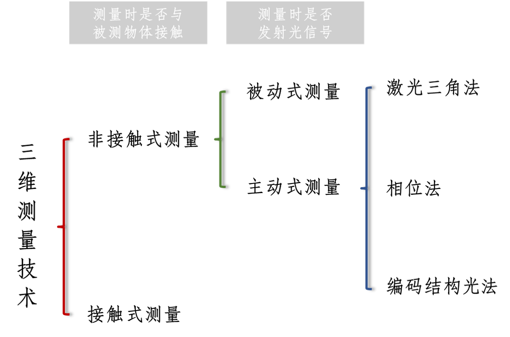
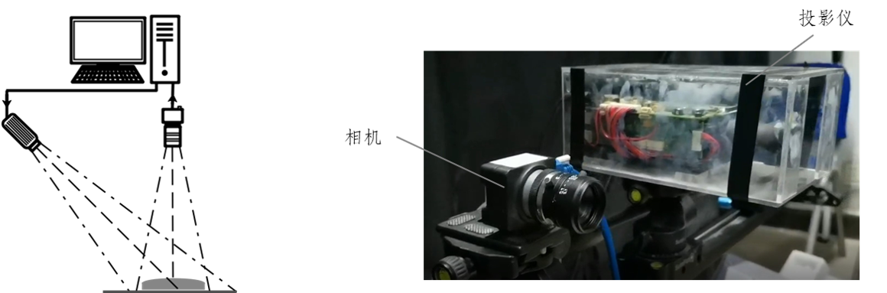

<h1 align="center">
  
   
  基于编码结构光的高铁轮轨姿态三维重建
</h1>

  3D Reconstruction of high-speed rail-wheel based on coded structured light

  
  
 <!---->
  
    
  
  
   
   
    
    <a href="./Readme-en.md">
      <img src="https://img.shields.io/badge/Readme-English%20Version-blue?style=for-the-badge&logo=data:image/png;base64,iVBORw0KGgoAAAANSUhEUgAAAGQAAAAyCAIAAAAlV+npAAAAAXNSR0IArs4c6QAAAARnQU1BAACxjwv8YQUAAAAJcEhZcwAADsMAAA7DAcdvqGQAAA0xSURBVGhD7ZsJVFPHGoDNTVgEElAh7FZ9VVYJsoprEcHWBRHFFZEdqeJSRK3ia23Fp7gUAWUTFdnEVkClisEFRBFlRwS0+qysAUQhrEII70/uFAghCIrbO3zH47nzzw3cfPnnn7k3A6FwgZ3iDlfKTP0RAih+xvDyT4y8+AC1h47Vi/UjfrODA3ZzS46GGauOicd7QZKiTHlEx8RGwrH11tNRFzPw+FCBYYTFprR/b5pPU1Nqr66tibrICIiAA9TNhTxNR2mHK8a8m1Vk7lhk4VyXdAf18KL6L7nw32yzE3Y5rpiOQv8vSIiJgKa8q57Rx+zVR4syAiMLvllZ+otvlykCkUierqt2MUQl5jhllgGGR5kp9x8v3/B4xcb6lPt4pBfa6krB/1mTe2X3KnN9+ChQ9ItlpKgwaEqJ+SHGz0FFRvzV6fP5RpYvfvRuq6we0dkJJ4AmsKMaG6gWFwwHRAkxCGKYqAj35Rzq6KnFFs5Fixzqb6WjEC9aqoqRPnYF1/bYWRmh0JcGaLIwoz2I3xEX5DJZQbLm2Kn8qZYvdh5kva7HT4DxLq6joXohAP6BJoIQCY8DmO7TFKXdG3sqY97JLLZ0KTJ36mdghh5cm5/oabN0Kgp9CUiSRy5foJscvSU20GWSlHD5kZDCb23K9h9vr6rBTwBNlBl6k84e0Ug8S5ltSCB1a8LBnlY3KG5z0itLV9zuIiQzBoVBWeoDGJhPVm9uSMtCIV40JymcOWSTd2X3svk6n/nAhMuzmq9DP+t2zs9BV1Wh0j8MalPZPv+WJ8/RGVDCDbVBk9rlUEmT6T2zqYuipwxM1eTn1ZtP5RSVKf34PS07YezerUIyo1H/iBGvryYXLrAvWmgP7lCIl8mqiuf9HXP+3LViod5nqAwuCbLpftyOGH9HbQVK+eGQPO35JXuOcmoTFwIRIxvpgCP1xDDQhAd7kVVQYrk+iPbdPgJhvCu0SUTMaoGuu6OJjubYDmZjddgfZftPsFvf4GfjQGbKu62TEvATgeyCEr+w5PDY+2xujXwrH3TpIDZSeI6RipfH4knjqRiT+SruWoXP6a76DRAwjiaFHxwk50zDI/zczXwWej4tIv4+i8WGJpKFgyv7afMC+AXwBqpCYyp9w9pfvkLdXECZooczZboeavNR8KTiV98rF67mvFXZB5IlKiJkMl3Vy91cZYIs6U1rTURc+aHgnj8cNEkYTYGRRNanEYSFUJSXvKIy7yD65RsPG5u6M4ZHFg4os/x2yk5XM211ZVbt6+ozFyoDI1gvX6NuLqBMYZNtP58JKDsUlBQZ/6AfZUMuCzTNN9bc4/adlqoSq6a2JvJiVUh014gDsJGiMNP1o4nVwYbxcTCQnnSnqKcmnD5kdQGT3RY7Y1DW2dZefvRkpc8p9ps21MdF0thIztVaynQGavORW1h2NPR6VHxGn8qGUJYURWzONBUP57kGtPGslxxNL2MSWoqfoW6uJgkdTfktdpKzDAVpKnxSeeTk9Th6Lr8mnP5k4UCWHdhu8fU4mU5WR8XRk4zgaEg31McFskxp1wayAQ21+YAs+/m3hDh6XievsiGRRSAQVizU3WRrbKg9bkQ7q8LnVHV4bFsZA3VzoczQV3B3lJw9dYSAGSi7oPRg0LU/bxQ0t/JkQy/eLgtnjYWBh7MpLEo7mpqrQs5V+oWxXtWhPi7kqVOUPDf2U8sgvQ8EXLuQmNul7D1l4Zo224Gm8ZxyER4HF9ZWUYX3csAwyjRduCpYFqAIH5D7Xv5XL13Pb2d1oJBgBioLIJGwRSZaUP45yhpBWXTZgQAYoaibi4S+ljIom2WI2nw8/m/VPv+r8IZB2TvLGikqZGykss99EV5Va+PpUMLbq17i53MATTP15TfaSM0VWCLSc54HRaVGXcpob3+7JpxByOpi1SK9X93NJ4yVBmVoruHNMslvpsISFyZm1OYjvwhelASDIvyoLTQHLstxR0Rj85vtLmbqE+VITU3Vp3+vPB7edafCAcMkZxkobHWQMNTGRIRRkBfQFBiVGpeY29DUikID411k4awy19uxfh4ny+obGCHRjBMRPBcNlYJ70SAOtfmoftlAlSbDwcBlVVTVy1Mp7Yya2gtXGYFRbeXdtQnu2MSnaCh7uonravapqYMNM13p4eCkxJTCwWrCIVg4B6LDd2LlIt1l3+kQiVhnezus+pryClHHP5ANtKn2y/G7dkEMXBbQ+vQFLADflFbgTRwCkSjnskaQJpzoy5mJyY+Yje+iCYfQa4b6JAxK1icEPc8aZiAQOppb0OGng93cmqe3SFBmESXJ2lkJmJgoan86CBlKn8UzKXZrWyeLhRp89F/yPhqEdCktdDjM2xiuWYNgWNYgGJY1CIZlDYJhWYNgWNYgGJY1CD6XRWlHYzM64oNAImGiAm+PPyafy+1Oru7CjvoG1OYFbqRpmZc/i9ud4acOA2e4Zg2C93r4R5YQmWUw0W6ZEZHYt/TOtvbGrIfVZ/7oaOIpSaTRo2QdlovT1PDmEGQWu7Pq5Ln62w/gd6IIF9EJXylucyJSJOA4np4XdqHv3UED5B0fK5PFRRaaTHZ3MqWpKvZpCjQx07IY/mfhf3ZL98NJYSU5WbvlMmstSNJjausapUdx3sbAZTFqmHIyFDzOT/2te4zAyDp6KmpzEZIeJeu0Sm79GlCWW1h2IiIFlA38S4qeDFoWaJo7Q22TrfFsw4koxAtoasotLPcOqrt1bwSbs0UAR1iBSrVfTl23jE0hPy+t9Q6iEzFCyAFr6Bq4rLVbzzQ2v9nvsVjtazm8l5/GzIclnocb7ueiNhdspKjidhd5t3UEIvFZycsfveP/uJKN+gbM4L4KW22uv9XBhKamhEJ8NKRllXodb0jP6amJNEZKfoONjPUSIZnRGfkvDgXRryQ/am5pe5/vDS3MaF7b+lMG11Dm5c+8k4naXECZ/CZb+Q1riWSJkopXu7wvRl0SuBmAnwHJIhGxNRYGbuu+0dEci0J81N+EIRBRdyONJ5vkZagOK6jrlgpJj35YXO5z+tbZ2PSODnTC+3/Jum6p4SbbOdrqAj+8+ptpjIDIuus8u/JAmYK7o5zLaqKE+KO/Kr0D6ecuZw7Bl6ygabEpbcd6Mz2tr1CID+adDMbx8NeJKajNRVhBlmq7DC4II0sUPC4/wL2gD/H1PQBXeNRz6XhladTmA/K9ZO+xxgd5qM2FICQkv9FGyXMjAcOgLOw6FB+T0Pe2vS4EypIQEzGbpX5gu8U4pTEwAFG0B53tLE6q7/NrKngC7xZFOdlEpdpZyTqvJElS7mY+8z1zi55aVN/Qx9J3qGQBkGWLTbV2us4zoI1DIT4a7mVX+p7p9aGSRktRbSwVttoTKeTCp5Unwm+fCOc5oSd9yBIXE1lgrLnNaa62urJATfCLT4QzUzP4NC3jDDqqdNbDEt+wW7GJuU3Nfe9IAYZQFg7MGGstp262M+6nqtZdv8sIiIDhidpcQJmc6xq59dZECbHsgpLj4SnhcWgDW094ZIGmOUYqP21eoKOpjEK8gKam/KLSn3wa0rM7/yk9gLCcDGems13aKSn5d/krmGsSUwpb+t2RAgy5LBzIsiXzOOVfZYIsCvEBY6J07zHORNQDoriYrNNKpT1uMDCfvajZ63slIo5nozuSBbVplbn+Fvs5UzT61gTAp1Hhc6ohDTT9UwsJBCFZaXlXa+mVizpHSUFtOhSclHCzoJ9s6skHktWF5bdT3B1NjHQmoDYfMDIq/c702pQNymDGxNdlsMg4EpIUGIkWbgTS1xtgQbDBZnY/o515+wGkLvzQbk2w2JOTkbVdBuVJiDqm8K/Kg4H06MsZ/KnbDx9aFoBhBDurabAqnKyigEJ81CWlcgYm79Z/GI8K7k6y9stBWV5R2ZGQ6zBBEXILS/sZ4aCp4tgpWBagNhfQJOe8CjTB24Ci6LE/9trtQjZ70DfkH0FWF+Zztbw8FmtMlEdtPjjv1Ce0lzKCiLCC2zrFna6wlP3r7+q+nzp0sqCE55QdCGjKK2L3uK0TUZaHtaWs8yp4A7fuPQmOTgVNdcx3fMjzMWUBkGVL5mnDonpaPwPzTgaUmnpYLfYAFolQjuU32/WW1cnqgLJX6XuamZbNo2msAhQmOVdruHRIRr+w5PMJWU0tbynh/fORZeHgA3OL3RyNSQKzrP7G3Qq/MCbvnzFhoiLdKwPQBPd0j62+L17iDOWpyxSUcOV/b9Kgh8tuc3la22zuGDDT6sjp3++9p6lPBZSL0Ji7tPn7lrgEFj/j2XrahaTJdLX4YLVLJ6XMZqIQvLD1DUdWR1Nzfcp90PTI1Lo+OR2scTq5M93Yfe6ayedkNtrm1zTbepw1tPBOuPnwC9XUE1B2MSlf3fSXlW6h93K6/yilJ5SZ+iox/qqxgV072DEmrLLX7y62cO7WBNlElVZ0d5qcEgM3wM+b2S67o6ZZHoq+lPFuG+Y+Z87/mTXT6rCrZ3TRUwFZZmykeiFgUtQxykz9/wFQbAgCtMlMgwAAAABJRU5ErkJggg=="/>
    </a>
     
     
 <!-- 

    <a href="./Readme.md">中文版本</a>
    ·
    <a href="./Readme-en.md">English Version</a>
  
-->

## [👁️‍🗨️](https://emojipedia.org/eye-in-speech-bubble/) 基本概述

高铁轮轨姿态反映了车轮与钢轨之间复杂的动态相互作用和约束关系，掌握他们之间真实接触姿态是保障高速铁路安全运营的重要基础。如何能够精确获得高铁轮轨姿态一直是国内铁路科研的热门研究领域。但单单从二维图像上获取轮轨接触姿态是不精确、不可靠的，而将轮轨表面的特征点提取出来，重建出一个三维模型能更加真实、准确地获得轮轨接触姿态。

由于高铁列车运行速度快，轮轨表面相对光滑且无明显特征点，给基于特征点提取的三维重建带来了极大挑战。

     
     

三维重建技术是计算机视觉技术的一个重要分支，是计算机视觉和计算机图像图形学相结合的一个热门研究方向。根据测量时是否与被测物体接触，可分为接触式测量和非接触式测量。

接触式测量方法虽然测量精度高，但测量效率低，速度慢，操作不当很容易损坏被测物体表面，而且由于探头有一定表面积，对表面复杂的物体难以测量，不具备普遍性和通用性。非接触式三维测量方式又可以分为两大类：主动式测量和被动式测量。前者是向目标物体表面投射设计好的图案，该图案由于物体的高度起伏引起一定的畸变，通过匹配畸变的图案获得目标物体的。后者是通过周围环境光对目标物体进行照射，然后检测目标物体的特征点以得到其数据。非接触式测量方式以其无损坏、测量速度高、简单等优点已成为三维轮廓测量的研究趋势。

项目采用的编码结构光法利用投影仪投射出的一定模式的编码结构光图案对目标物体进行编码，利用摄像机获取物体图像，通过计算机对所得图像进行解码处理，利用摄像机中的图像点和投影仪中的点对应关系计算物体表面点的空间坐标，获得物体的三维信息，从而还原物体三维形状，结构光系统如下图所示。

编码结构光法三维重建技术主要由系统标定、结构光编码、图像获取、结构光解码和三维坐标计算等5个关键技术组成。

- 系统标定：系统由摄像机、投影仪和计算机组成，标定的目标是计算摄像机和投影仪内参矩阵、镜头畸变系数和两者之间相对位置的外参矩阵；
- 结构光编码：通过编码的方式使图像每一点的“身份”可以被识别；
- 图像获取：投影仪向物体投射编码结构光图案，图案会随物体表面形状的调制而发生畸变，摄像机拍摄被物体调制过的结构光图像，变形的图像反映了物体表面形状的三维信息；
- 结构光解码：对捕获的结构光图像进行解码，解码的方法取决于编码的方法，目的是建立相机平面和投影平面特征点之间的对应关系；
- 三维坐标计算：利用解码算法得出的特征点对应关系和系统标定结果，基于三角测量原理求出特征点的三维信息。

结构光的编码方式主要有时间编码和空间编码两种。时间编码虽具有较好的重建精度，但由于需要向物体表面投射多张图片，所以对于运动物体来说时间编码的结构光重建不是一个好的选择。空间编码相较于时间编码重建精度较低，但由于只需投射一张图片，所以常常用于动态物体的物体重建。

综上所述，针对项目中轮轨表面光滑，特征点不易提取的难点，可以通过向物体表面投射编码图案，人为地增加物体表面的特征点。由于空间编码只需单次投影，适合对高速运动的高铁轮轨进行重建。因此，本项目主要研究通过空间编码结构光方法获得相对更高精度和高密度的三维点云（点云，即物体表面特征点的集合，这些点包含了物体表面的三维坐标及颜色等信息）。

## [📷](https://emojipedia.org/camera/) 技术路线

<table><tr><td width="500px">

</td><td>项目主要创新点如下：
    <ul><li><b>亚像素级条纹中心的提取</b>：设计实现了编码结构光图案以及适用于该图案的条纹中心点提取算法，将条纹中心点精确到亚像素级别</li>
        <li><b>通过小波变换增加点云稠密度</b>：提出了加窗傅里叶变化对条纹相位分析的改进方法，采用用基于广义 Morse 小波的小波变换进行分析，获得非中心点的相位信息，增加点云稠密度</li>
        <li><b>构建三维重建全流程平台</b>：将上述算法与点云可视化封装成结构光三维重建软件，完成了铁轨及多个几何体的三维重建，预期可用于轮轨姿态重建和可视化</li></ul></td></tr></table>

<table> <tr> <td>编码图案</td><td width="600px">在 HSV 颜色空间下对编码图案进行设计，图案由彩色正弦条纹图案组成
<ul>
<li> H 通道以 𝐵(3,4) 序列进行编码，条纹作为编码图案的基本元素，不同的数值分别对应红、蓝、绿三种颜色</li>
<li> S 通道设定为1</li>
<li>V 通道按照给定的余弦函数计算每一个像素点的值</li>
</ul>
    
编码图案共64条条纹，条纹宽度14 𝑝𝑖𝑥𝑒𝑙，以条纹中心点作为投影图案的特征点

♣ 𝐷𝑒 𝐵𝑟𝑢𝑖𝑗𝑛 序列由 𝑛 种不同元素构成，任意长度为 𝑚 的连续子序列只出现一次
    </td><td>

</td></tr><tr><td>德布鲁因分析</td><td>在对灰度图像进行预处理后，为获得条纹中心点的位置，采用局部最大值算法从类似“高斯”形状的条纹灰度图像中提取图像每一行的局部最大值（以亚像素精度检测），局部最大值点即为条纹的中心点。在 𝐿𝑎𝑏 颜色空间下，对条纹中心点的颜色进行分类，在 4×1 的窗口中，即可获得条纹中心点在投影图案的对应位置。
</td><td>

</td></tr><tr><td>小波变换分析</td><td>V 通道的变化满足给定的余弦函数，包含了条纹非中心点的相位信息。但图案经过物体的调制，原本平稳的信号发生了改变。小波变换方法作为一个非平稳信号处理方法，被引入到许多信号处理领域，包括从条纹图中提取相位。综合对比了一维和二维的窗口傅里叶变换、小波变换等方法，出于对重建精度和速度的考虑，选择一维小波变换的方法。广义 Morse  小波具有灵活的时频局部特性及严格解析性，且测量物体 3D 轮廓效果优于目前流行的用复 Morlet 小波作为母小波。</td><td>

</td></tr></table> 

## [📽️](https://emojipedia.org/film-projector/) 评价指标

<table> <tr align="center"> <td>

</td><td>
   

 </td><td> 

 </td></tr><tr align="center"><td>半径95mm的球体 表面点云17W+ 半径误差0.678mm 运算时间10-15s</td><td>多物体三维重建</td><td>铁轨表面三维重建</td></tr></table> 

## [💻](https://emojipedia.org/laptop/) 软件展示

<a style="color:black" href="./Exe/Reconstructionn.exe">软件</a>集三维重建整个流程为一体，主要实现系统（相机与投影仪）标定、三维重建和点云渲染三个功能。软件以 C++ 作为开发语言并基于  QT  框架进行界面开发，依赖于 OpenCV 和 PCL (Point Cloud Library) 进行图像和点云数据处理。在开发上采用了单例模式、责任链模式等设计模式。 

- 系统标定界面

- 三维重建界面

- 点云渲染界面

## [🔧](https://emojipedia.org/wrench/) 开发配置

<table><tr align="center" style="background-color:#D9E2F3"><td width="500px">硬件环境</td><td  width="500px">版本</td></tr><tr align="center"><td>Point Grey Camera</td><td>——</td></tr><tr align="center"><td>LightCrafter4500</td><td>——</td></tr></table>
<table><tr align="center" style="background-color:#D9E2F3"><td  width="500px">软件环境</td><td  width="500px">版本</td></tr><tr align="center"><td>Windows</td><td>Windows 10</td></tr><tr align="center"><td>Visual Studio</td><td>2017</td></tr><tr align="center"><td>QT</td><td>5.12.3</td></tr><tr align="center"><td>OpenCV</td><td>4.2.03</td></tr><tr align="center"><td>FlyCapture2</td><td>2.12.3.2</td></tr><tr align="center"><td>PCL</td><td>1.8.1</td></tr><tr align="center"><td>VTK</td><td>8.0</td></tr></table>

<text style="color:red">说明</text>：需配置电脑的环境变量、Visual Studio 中项目的属性（VC++ 目录-包含目录、VC++ -库目录和链接器-输入-附加依赖性）

## 📜 开源许可

代码在 [Apache 2.0 License](https://www.apache.org/licenses/LICENSE-2.0) 下可用

